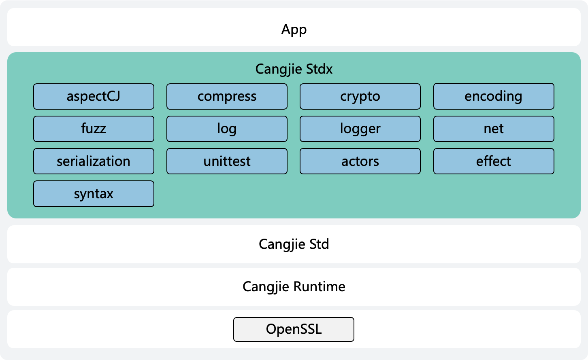

# Cangjie stdx

## Introduction

The extension library `stdx` is an extension module provided by the Cangjie programming language (i.e., a non-core standard library, but an official supplementary feature set). It is a key component of the language ecosystem, supplementing Cangjie with more practical capabilities covering multiple domains, including aspect-oriented programming, compression and decompression, security (secure encryption capabilities/message digest algorithms/Asymmetric encryption and decryption and signature algorithms/digital certificate processing functions), encoding and decoding (base64/hex/json/url), networking (http/tls), logging, syntax parsing, unit test extensions, concurrent programming model, non-local control operation and serialization.

Architecture Diagram:



- actors: Provides a concurrent programming model designed to simplify the handling of concurrent tasks.
- aspectCJ: Provides annotations related to aspect-oriented programming in Cangjie.
- compress: Provides compression and decompression functions.
- crypto: Provides a utility library for cryptographic operations.
- effect: Provides a powerful non-local control operation.
- encoding: Provides a basic utility library for data encoding and decoding.
- fuzz: Provides an automated software testing method.
- log: Provides a single logging API.
- logger: Provides log printing functions in text format and JSON format.
- net: Provides network communication and secure transmission functions.
- serialization: Provides the capability of serialization and deserialization.
- syntax: Provides Cangjie source code syntax parsing functions.
- unittest: Provides the capability to supply test data in serialized input formats when writing unit test code for Cangjie projects.

## Operating Instructions

For APIs related to stdx, please refer to [API Interface Description](./doc/summary_cjnative_EN.md).
For relevant guidance, please refer to [Development Guide](https://gitcode.com/Cangjie/cangjie_docs/).

## Quick Start

This repository provides convenient scripts to quickly download and extract binary artifacts for a specific version.

### Linux/macOS

This requires `curl` and `unzip`. Please ensure these tools are installed in your environment.

Execute directly in your command line (note the arguments at the end, modify as needed):

```shell
bash -c "$(curl -fsSL https://raw.gitcode.com/Cangjie/cangjie_stdx/raw/dev/downloader.sh)" -- 1.0.0.1
```

### Windows

Before running the script, you may need to adjust the PowerShell execution policy (only needs to be done once).

Please open PowerShell as an administrator and run the following command:

```powershell
Set-ExecutionPolicy -ExecutionPolicy RemoteSigned -Scope CurrentUser
```

Then, run the script in a regular PowerShell window (note the arguments at the end, modify as needed):

```powershell
irm https://raw.gitcode.com/Cangjie/cangjie_stdx/raw/dev/downloader.ps1 -OutFile "$env:TEMP\downloader.ps1"; & "$env:TEMP\downloader.ps1" 1.0.0.1
```

### Parameters

-   `<version>`: **Required**. Specifies the version to download, e.g., `1.0.0.1`.
-   `-p <platform-arch>`: **Optional**. Specifies the platform and architecture. If omitted, the script will auto-detect the current system.
-   `-d <extract-dir>`: **Optional**. Specifies the target path for extraction. If omitted, it defaults to the current directory.

**Usage Examples:**

```shell
# On Linux/macOS, download the ohos-aarch64 version of v1.0.0.1 and extract it to the ./cangjie_libs directory
bash -c "$(curl -fsSL https://raw.gitcode.com/Cangjie/cangjie_stdx/raw/dev/downloader.sh)" -- 1.0.0.1 -p ohos-aarch64 -d ./cangjie_libs
```

```powershell
# On Windows, download the windows-x64 version of v1.0.0.1 and extract it to the C:\cangjie_libs directory
irm https://raw.gitcode.com/Cangjie/cangjie_stdx/raw/dev/downloader.ps1 -OutFile "$env:TEMP\downloader.ps1"; & "$env:TEMP\downloader.ps1" 1.0.0.1 -p windows-x64 -d C:\cangjie_libs
```

### Supported \<platform-arch>

The following platform and architecture combinations are currently supported:

-   `linux-aarch64`
-   `linux-x64`
-   `mac-aarch64`
-   `mac-x64`
-   `ohos-aarch64`
-   `ohos-x64`
-   `windows-x64`

## Project Directory

```text
/stdx
├─ build                        # Directory of Engineering Construction
├─ doc                          # Directory of STDX library document
├─ figures                      # architecture pictures
├─ src                          # Directory of STDX package codes                     
│   └─ stdx
│       ├── actors              # Provides Actors
│       ├── aspectCJ            # Provides AOP
│       ├── compress            # Provides compression and decompression
│       ├── crypto              # Provide security related capabilities
│       ├── effect              # Provides user-level APIs for handling the Effect Handler feature. This is an experimental feature and requires the use of a Cangjie compiler that supports this mechanism.
│       ├── dynamicLoader       # Openssl dynamic loading module
│       ├── encoding            # Provide JSON and string encoding related capabilities
│       ├── fuzz                # Provides the Cangjie fuzz engine based on coverage feedback
│       ├── log                 # Provides logging related
│       ├── logger              # Provides log printing functions in text format and JSON format
│       ├── net                 # Provide network communication and other capabilities
│       ├── serialization       # Provides serialization and deserialization
│       ├── syntax              # Provides syntax parsing functions
│       └── unittest            # Provides unit testing extension
│
├─ third_party                  # Directory of third-party components
└─ target                       # Directory of constructed products
```

## Constraints

Support for building `stdx` in Ubuntu/MacOS (x86_64, aarch64), Cangjie SDK 1.0.0 and above versions, please refer to the [Build Dependency Tools](https://gitcode.com/Cangjie/cangjie_build/blob/dev/docs/env_zh.md).

Note: Future versions of this extension library may contain incompatible changes, and cross-version backward compatibility is not guaranteed. Please fully assess the version adaptation risks before use.

## Compilation and Building

### Build Steps

#### Configure Cangjie SDK

Configure the Cangjie SDK environment:

```shell
source <cangjie sdk path>
```

Execute the following command to verify whether the installation is successful:

```shell
cjc -v
```

#### Build Command

Download the source code

```bash
git clone https://gitcode.com/Cangjie/cangjie_stdx.git
```

Enter the project directory, and run the following commands:

```shell
python3 build.py clean
python3 build.py build -t release --target-lib=<absolute path of openssl lib>
python3 build.py install
```

1. `build.py clean` command is used to clear temporary files in the workspace.
2. `build.py build` command starts the compilation：

    - `-t` or `--build-type`，specifies the type of build artifact, which can be either `release` or `debug`
    - `--target-lib` specifies the openssl lib directory

3. `build.py install` ommand installs the build artifacts to the `output` directory.

If the compilation is successful, a product directory named target by default will be obtained in the project directory.

### Get More Help Information

For more information, please take a look at the [build.py](build.py) or use `--help`

### Integration Build Guide

For integration building, please refer to the [Cangjie SDK Integration Build Guide](https://gitcode.com/Cangjie/cangjie_build/blob/dev/README_zh.md).

## Instructions for use

`stdx` provides two types of binaries: static and dynamic. Both are used independently and developers can reference them according to actual conditions.

### Import stdx

Add the following configuration to the `cjpm.toml` file of the code project:

```toml
[target.x86_64-w64-mingw32]                                                     # System architecture and OS information
  [target.x86_64-w64-mingw32.bin-dependencies]
    path-option = ["D:\\cangjiestdx\\windows_x86_64_cjnative\\stdx\\dynamic\\stdx"] # The stdx path is configured according to the actual situation
```

explain:

- x86_64-w64-mingw32：This configuration item indicates the operating system architecture information of the machine where the code is compiled. This information can be obtained by executing `cjc -v`. Developers should configure according to the actual situation. For example, the output of executing `cjc -v` is as follows, and the configuration is `x86_64-w64-mingw32`.

  ```text
  Cangjie Compiler: 0.59.4 (cjnative)
  Target: x86_64-w64-mingw32
  ```

- x86_64-w64-mingw32.bin-dependencies：Please replace x86_64-w64-mingw32 in the configuration with the actual operating system information.
- path-option：`stdx` The path where the binary is located.

> **illustrate:**
>
> - `cjpm.toml` is the configuration file of the Cangjie package management tool CJPM. For details, please refer to the Cangjie Programming Language Tool User Guide.
> - The configuration method is the same for Windows, Linux, and MacOS.
> - If you import the static library of `stdx` and use the crypto and net packages, you need to add `-lcrypt32` to the `compile-option` configuration item of `cjpm.toml` under the `Windows` operating system, and `-ldl` under the `Linux` operating system, because they need to rely on system symbols.

**Configuration example**：Assuming the development environment is Windows x86_64, import the dynamic binary of `stdx`, then the `cjpm.toml` configuration example is as follows:

```toml
[dependencies]

[package]
  cjc-version = "0.59.4"
  compile-option = ""
  description = "nothing here"
  link-option = ""
  name = "test"
  output-type = "executable"
  override-compile-option = ""
  src-dir = ""
  target-dir = ""
  version = "1.0.0"
  package-configuration = {}

[target.x86_64-w64-mingw32]                                                     # System architecture and OS information
  [target.x86_64-w64-mingw32.bin-dependencies]
    path-option = ["D:\\cangjiestdx\\windows_x86_64_cjnative\\stdx\\dynamic\\stdx"] # The stdx path is configured according to the actual situation
```

### Using stdx

In the Cangjie source code file that needs to use `stdx`, import the corresponding package provided by `stdx` through import, and then call the API provided by the package. The import format is:

**import stdx.fullPackageName.itemName**

`fullPackageName` is the package name given in [package list](./doc/libs_stdx_en/libs_overview.md#package-list), `itemName` is the name of a visible declaration or definition,  `*` means importing all visible top-level declarations or definitions, for example:

- import stdx.net.http.ServerBuilder：Import the top-level declaration of ServerBuilder in the net.http package of the stdx module.
- import stdx.net.http.\* ：Import the net.http package of the stdx module.
- import stdx.log.\* ：Import the log package from the stdx module.

### Usage Examples

Assuming that the developer is developing on Linux and wants to import the static binary of `stdx`, the `cjpm.toml` configuration reference is as follows:

```toml
[dependencies]

[package]
  cjc-version = "0.59.4"
  compile-option = "-ldl"
  description = "nothing here"
  link-option = ""
  name = "test"
  output-type = "executable"
  src-dir = ""
  target-dir = ""
  version = "1.0.0"
  package-configuration = {}

[target.x86_64-unknown-linux-gnu]
  [target.x86_64-unknown-linux-gnu.bin-dependencies]
    path-option = ["/target/linux_x86_64_cjnative/static/stdx"]  # stdx path is configured according to actual situation
```

Write code: Create an `HTTP` service using the `net.http` package.

```cangjie
package test

import stdx.net.http.ServerBuilder

main () {
    // 1. Build a Server instance
    let server = ServerBuilder()
                        .addr("127.0.0.1")
                        .port(8080)
                        .build()
    // 2. Register HttpRequestHandler
    server.distributor.register("/index", {httpContext =>
        httpContext.responseBuilder.body("Hello 仓颉!")
    })
    // 3. Start the service
    server.serve()
}
```

## License

Please see [LICENSE](LICENSE) for more information.

## Contribution Guidelines
Developers are welcome to make contributions in any form, including but not limited to code, documentation, and issues.