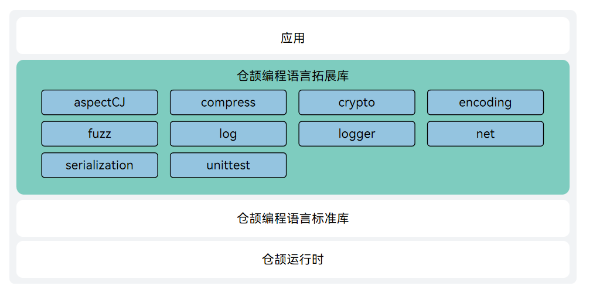

# 仓颉编程语言 stdx

## 简介

拓展库 `stdx` 是仓颉编程语言提供的拓展模块（即非核心的标准库，但官方提供的附加功能集），是该语言生态中的重要组成部分，为仓颉补充了更多实用能力，涵盖面向切面编程、压缩和解压缩、安全（安全加密能力/消息摘要算法/非对称加解密和签名算法/数字证书处理功能）、编解码（base64/hex/json/url）、网络（http/tls）、日志、单元测试拓展、序列化、并发编程模型、非局部控制操作等多个领域。 

架构图：



- aspectCJ: 提供了 Cangjie 中面向切面编程的相关注解。
- compress: 提供了压缩解压功能。
- crypto: 提供了密码学操作的工具库。
- encoding: 提供了数据编码与解码的基础工具库。
- fuzz: 提供了一种自动化软件测试方法。
- log: 提供了一个单一的日志 API。
- logger: 提供了文本格式和 JSON 格式日志打印功能。
- net: 提供了网络通信和安全传输功能。
- serialization: 提供了序列化和反序列化的能力。
- unittest: 提供了在编写仓颉项目单元测试代码时输入序列化格式的测试数据的能力。

## 使用说明

`stdx` 相关 API 请参见 [API接口说明](./doc/libs_stdx/summary_cjnative.md)。
相关指导请参见 [开发指南](https://gitcode.com/Cangjie/cangjie_docs/)。

## 目录结构

```text
/stdx
├─ build                        # 工程构建目录，编译构建工具、脚本等
├─ doc                          # STDX 库资料目录
├─ figures                      # 存放readme中的架构图
├─ src                          # STDX 各个包代码目录                        
│   └─ stdx
│       ├── aspectCJ            # 提供 AOP 功能
│       ├── compress            # 提供压缩和解压缩功能
│       ├── crypto              # 提供安全相关能力
│       ├── dynamicLoader       # Openssl 动态加载模块
│       ├── encoding            # 提供 JSON 和字符串编码相关能力。
│       ├── fuzz                # 提供基于覆盖率反馈的仓颉 fuzz 引擎及对应的接口
│       ├── log                 # 提供了日志记录相关的能力
│       ├── logger              # 提供文本格式和 JSON 格式日志打印功能
│       ├── net                 # 提供网络通信等能力
│       ├── serialization       # 提供序列化和反序列化能力
│       └─  unittest            # 提供单元测试扩展能力
│
├─ third_party                  # 第三方组件目录
└─ target                       # 编译构建产物目录
```

## 约束

支持在 Ubuntu/MacOS(x86_64, aarch64)、Cangjie SDK 1.0.0 及以上版本中对 `stdx` 构建。更详细的环境及工具依赖请参阅 [构建依赖工具](https://gitcode.com/Cangjie/cangjie_build/blob/main/docs/env_zh.md)。

注意：本拓展库后续版本可能存在不兼容变更，不承诺跨版本 API/ABI 兼容性，使用前请充分评估版本适配风险。

## 编译构建

### 构建步骤

#### 配置 Cangjie SDK

```shell
source <cangjie sdk 路径>
```

通过下面命令，验证 Cangjie SDK 是否配置成功:

```shell
cjc -v
```

#### 构建命令

下载源码

```bash
git clone https://gitcode.com/Cangjie/cangjie_stdx.git
```

进入工程目录，运行下面构建命令:

```shell
python3 build.py clean
python3 build.py build -t release --target-lib=<openssl lib 路径>
python3 build.py install
```

1. `build.py clean` 命令用于清空工作区临时文件。
2. `build.py build` 命令开始执行编译：
   - `-t` 即 `--build-type`，指定编译产物类型，可以是 `release` 或 `debug`
   - `--target-lib` 指定openssl lib目录
3. `build.py install` 命令将编译产物安装到 `target` 目录下。

编译成功会在工程目录中得到默认名称为 target 产物目录。

### 更多构建选项

请参阅 [build.py](build.py) 或通过 `--help` 选项了解更多编译选项。

### 集成构建指导

集成构建请参阅 [仓颉 SDK 集成构建指导书](https://gitcode.com/Cangjie/cangjie_build/blob/main/README_zh.md)。

## 使用指导

`stdx` 提供静态和动态两种二进制 ，两者独立使用，开发者可根据实际情况引用。

### 导入 stdx

在代码工程的 `cjpm.toml` 文件中增加如下类似配置：

```toml
[target.x86_64-w64-mingw32]                                                     # 系统架构和 OS 信息
  [target.x86_64-w64-mingw32.bin-dependencies]
    path-option = ["D:\\cangjiestdx\\windows_x86_64_cjnative\\stdx\\dynamic\\stdx"] # stdx 路径根据实际情况配置
```

其中：

- x86_64-w64-mingw32：该配置项表示代码编译所在机器的操作系统架构信息。该信息可以通过执行 `cjc -v` 获得。开发者请根据实际情况配置。例如执行 `cjc -v` 的回显信息如下，则该配置为 `x86_64-w64-mingw32` 。

  ```text
  Cangjie Compiler: 0.60.5 (cjnative)
  Target: x86_64-w64-mingw32
  ```

- x86_64-w64-mingw32.bin-dependencies：该配置中的 x86_64-w64-mingw32 请替换为实际的操作系统信息。

- path-option：`stdx` 二进制所在路径，请根据实际路径和使用动态还是静态二进制修改。

> **说明：**
>
> - `cjpm.toml` 是仓颉包管理工具 CJPM 的配置文件，详情请参见《仓颉编程语言工具使用指南》。
> - Windows、Linux、MacOS 的配置方式相同。
> - 如果导入 `stdx` 的静态库，使用 crypto 和 net 包时，由于需要依赖系统符号，所以在 `cjpm.toml`的 `compile-option`配置项里在  `Windows`操作系统下需要额外添加`-lcrypt32`，`Linux`操作系统下需要额外添加`-ldl`。

**配置示例**：假设开发环境为 Windows（架构为 x86_64），导入 `stdx` 的动态二进制，则 `cjpm.toml` 配置示例如下。

```toml
[dependencies]

[package]
  cjc-version = "0.60.5"
  compile-option = ""
  description = "nothing here"
  link-option = ""
  name = "test"
  output-type = "executable"
  override-compile-option = ""
  src-dir = ""
  target-dir = ""
  version = "1.0.0"
  package-configuration = {}

[target.x86_64-w64-mingw32]                                                     # 系统架构和 OS 信息
  [target.x86_64-w64-mingw32.bin-dependencies]
    path-option = ["D:\\cangjiestdx\\windows_x86_64_cjnative\\stdx\\dynamic\\stdx"] # stdx 路径根据实际情况配置
```

### 使用 stdx

在需要使用 `stdx` 的仓颉源代码文件中，通过 import 导入 `stdx` 提供的对应包，即可调用该包提供的 API。import 格式为：

**import stdx.fullPackageName.itemName**

其中 `fullPackageName` 为[包列表](./doc/libs_stdx/libs_overview.md#包列表)给出的包名，`itemName` 为可见声明或定义的名字,  `*` 表示导入所有可见的顶层声明或定义，例如：

- import stdx.net.http.ServerBuilder：导入 stdx 模块的 net.http 包中的【顶层声明】ServerBuilder。
- import stdx.net.http.\* ：导入 stdx 模块的 net.http 包。
- import stdx.log.\* ：导入 stdx 模块的 log 包。

### 使用示例

假设开发者使用 Linux 开发，并希望导入 `stdx` 的静态二进制，`cjpm.toml` 配置参考如下：

```toml
[dependencies]

[package]
  cjc-version = "0.60.5"
  compile-option = "-ldl"
  description = "nothing here"
  link-option = ""
  name = "test"
  output-type = "executable"
  src-dir = ""
  target-dir = ""
  version = "1.0.0"
  package-configuration = {}

[target.x86_64-unknown-linux-gnu]
  [target.x86_64-unknown-linux-gnu.bin-dependencies]
    path-option = ["/target/linux_x86_64_cjnative/static/stdx"]  # stdx 路径根据实际情况配置
```

编写代码：使用 `net.http` 包创建 `HTTP` 服务。

```cangjie
package test

import stdx.net.http.ServerBuilder

main () {
    // 1. 构建 Server 实例
    let server = ServerBuilder()
                        .addr("127.0.0.1")
                        .port(8080)
                        .build()
    // 2. 注册 HttpRequestHandler
    server.distributor.register("/index", {httpContext =>
        httpContext.responseBuilder.body("Hello 仓颉!")
    })
    // 3. 启动服务
    server.serve()
}
```

## License 许可

本项目开源许可请参阅 [LICENSE](LICENSE)。

## 参与贡献

欢迎开发者们提供任何形式的贡献，包括但不限于代码、文档、issue 等。