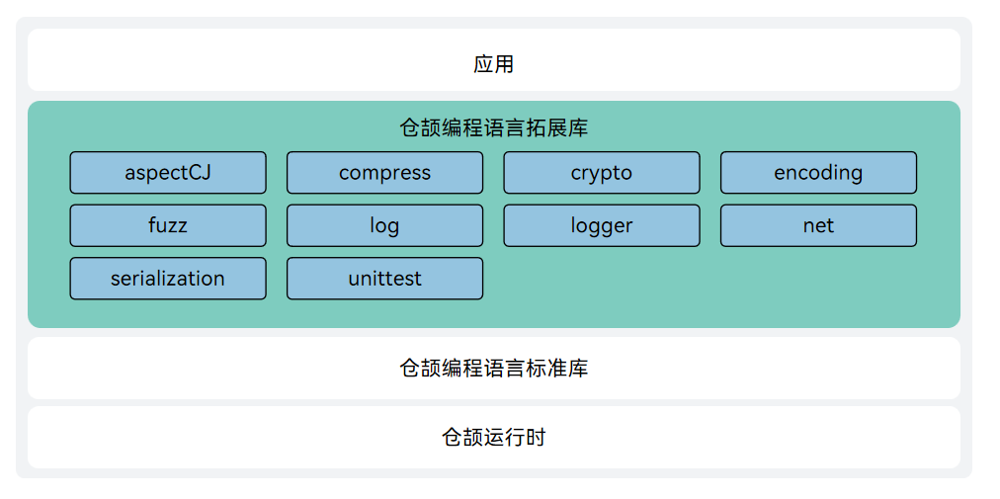

# 仓颉编程语言 stdx

## 简介

拓展库 `stdx` 是仓颉编程语言提供的拓展模块（即非核心的标准库，但官方提供的附加功能集），是该语言生态中的重要组成部分，为仓颉补充了更多实用能力，涵盖面向切面编程、压缩和解压缩、安全（安全加密能力/消息摘要算法/非对称加解密和签名算法/数字证书处理功能）、编解码（base64/hex/json/url）、网络（http/tls）、日志、语法解析、单元测试拓展、序列化、并发编程模型、非局部控制操作等多个领域。

架构图：



- actors: 提供了一种并发编程模型，旨在简化并发任务的处理。
- aspectCJ: 提供了 Cangjie 中面向切面编程的相关注解。
- compress: 提供了压缩解压功能。
- crypto: 提供了密码学操作的工具库。
- effect: 提供了一种强大的非局部控制操作。
- encoding: 提供了数据编码与解码的基础工具库。
- fuzz: 提供了一种自动化软件测试方法。
- log: 提供了一个单一的日志 API。
- logger: 提供了文本格式和 JSON 格式日志打印功能。
- net: 提供了网络通信和安全传输功能。
- serialization: 提供了序列化和反序列化的能力。
- syntax：提供了对仓颉源码进行语法解析的功能。
- unittest: 提供了在编写仓颉项目单元测试代码时输入序列化格式的测试数据的能力。

## 使用说明

`stdx` 相关 API 请参见 [API 接口说明](./doc/summary_cjnative.md)。
相关指导请参见 [开发指南](https://gitcode.com/Cangjie/cangjie_docs/)。

## 快速获取

本仓提供了快捷命令，用于快速下载和解压指定版本的二进制产物。

### Linux/macOS

依赖 `curl` 和 `unzip` 命令，请确保您的环境中已安装这些工具。

在命令行中直接执行（注意尾部的参数，按需修改）：

```shell
bash -c "$(curl -fsSL https://raw.gitcode.com/Cangjie/cangjie_stdx/raw/dev/downloader.sh)" -- 1.0.0.1
```

### Windows

在操作之前，您可能需要调整 PowerShell 的执行策略（仅需一次）。

请以管理员身份打开 PowerShell 并执行以下命令：

```powershell
Set-ExecutionPolicy -ExecutionPolicy RemoteSigned -Scope CurrentUser
```

然后，在普通 PowerShell 窗口中执行脚本（注意尾部的参数，按需修改）：

```powershell
irm https://raw.gitcode.com/Cangjie/cangjie_stdx/raw/dev/downloader.ps1 -OutFile "$env:TEMP\downloader.ps1"; & "$env:TEMP\downloader.ps1" 1.0.0.1
```

### 参数说明

- `<版本号>`: **必选参数**，指定要下载的版本，例如 `1.0.0.1`。
- `-p <平台-架构>`: **可选参数**，指定平台和架构。如果省略，脚本将自动检测当前系统。
- `-d <解压目录>`: **可选参数**，指定解压的目标路径。如果省略，默认为当前目录。

**参数使用示例:**

```shell
# 在 Linux/macOS 下载 v1.0.0.1 的 ohos-aarch64 版本，并解压到 ./cangjie_libs 目录
bash -c "$(curl -fsSL https://raw.gitcode.com/Cangjie/cangjie_stdx/raw/dev/downloader.sh)" -- 1.0.0.1 -p ohos-aarch64 -d ./cangjie_libs
```

```powershell
# 在 Windows 下载 v1.0.0.1 的 linux-x64 版本，并解压到 C:\cangjie_libs 目录
irm https://raw.gitcode.com/Cangjie/cangjie_stdx/raw/dev/downloader.ps1 -OutFile "$env:TEMP\downloader.ps1"; & "$env:TEMP\downloader.ps1" 1.0.0.1 -p windows-x64 -d C:\cangjie_libs
```

### 支持的 <平台-架构>

当前支持以下平台与架构组合：

- `linux-aarch64`
- `linux-x64`
- `mac-aarch64`
- `mac-x64`
- `ohos-aarch64`
- `ohos-x64`
- `windows-x64`

## 目录结构

```text
/stdx
├─ build                        # 工程构建目录，编译构建工具、脚本等
├─ doc                          # STDX 库资料目录
├─ figures                      # 存放readme中的架构图
├─ src                          # STDX 各个包代码目录                        
│   └─ stdx
│       ├── actors              # 提供 Actors 功能                     
│       ├── aspectCJ            # 提供 AOP 功能
│       ├── compress            # 提供压缩和解压缩功能
│       ├── crypto              # 提供安全相关能力
│       ├── effect              # 提供用于处理 Effect Handler 特性的用户级 API。这是一个实验性功能，需要使用支持该机制的 Cangjie 编译器。
│       ├── dynamicLoader       # Openssl 动态加载模块
│       ├── encoding            # 提供 JSON 和字符串编码相关能力。
│       ├── fuzz                # 提供基于覆盖率反馈的仓颉 fuzz 引擎及对应的接口
│       ├── log                 # 提供了日志记录相关的能力
│       ├── logger              # 提供文本格式和 JSON 格式日志打印功能
│       ├── net                 # 提供网络通信等能力
│       ├── serialization       # 提供序列化和反序列化能力
│       ├── string_intern       # 提供string对象的池化缓存能力
│       ├── syntax              # 提供语法解析能力
│       └── unittest            # 提供单元测试扩展能力
│
├─ third_party                  # 第三方组件目录
└─ target                       # 编译构建产物目录
```

## 约束

支持在 Ubuntu/MacOS(x86_64, aarch64)、Cangjie SDK 1.0.0 及以上版本中对 `stdx` 构建。更详细的环境及工具依赖请参阅 [构建依赖工具](https://gitcode.com/Cangjie/cangjie_build/blob/dev/docs/env_zh.md)。

注意：本拓展库后续版本可能存在不兼容变更，不承诺跨版本 API/ABI 兼容性，使用前请充分评估版本适配风险。

## 编译构建

### 构建步骤

#### 配置 Cangjie SDK

```shell
source <cangjie sdk 路径>
```

通过下面命令，验证 Cangjie SDK 是否配置成功:

```shell
cjc -v
```

#### 准备源码

下载源码

```bash
git clone https://gitcode.com/Cangjie/cangjie_stdx.git
```

#### 构建命令

##### 方式一

进入工程目录，运行下面构建命令:

```shell
python3 build.py clean
python3 build.py build -t release --target-lib=<openssl lib 路径>
python3 build.py install
```

1. `build.py clean` 命令用于清空工作区临时文件。
2. `build.py build` 命令开始执行编译：
   - `-t` 即 `--build-type`，指定编译产物类型，可以是 `release` 或 `debug`
   - `--target-lib` 指定 openssl lib 目录
3. `build.py install` 命令将编译产物安装到 `target` 目录下。

编译成功会在工程目录中得到默认名称为 target 产物目录。

更多构建选项请参阅 [build.py](build.py) 或通过 `--help` 选项了解。

##### 方式二

目前 stdx（dev 分支）也支持通过 cjpm 进行构建，构建命令如下：

```shell
cjpm build
```

cjpm 的详细使用可以参考 [cjpm 文档](https://gitcode.com/Cangjie/cangjie_docs/blob/main/docs/tools/source_zh_cn/cmd-tools/cjpm_manual.md)

通过 cjpm 进行构建存在一些依赖，参见[依赖列表](./doc/libs_stdx/source_code_dependency.md#依赖)。

目前通过 cjpm build 的 stdx 二进制包不包含 aspectCJ 和 syntax，并且在 Windows 平台上没有 fuzz 包。

### 集成构建指导

集成构建请参阅 [仓颉 SDK 集成构建指导书](https://gitcode.com/Cangjie/cangjie_build/blob/dev/README_zh.md)。

## 使用指导

### 导入 stdx

`stdx` 提供动态链接库和静态链接库，两者独立使用，开发者可根据实际情况引用。

在代码工程的 `cjpm.toml` 文件中增加如下类似配置：

```toml
[target.x86_64-w64-mingw32]                                                     # 系统架构和 OS 信息
  [target.x86_64-w64-mingw32.bin-dependencies]
    path-option = ["D:\\cangjiestdx\\windows_x86_64_cjnative\\stdx\\dynamic\\stdx"] # stdx 路径根据实际情况配置
```

其中：

- x86_64-w64-mingw32：该配置项表示代码编译所在机器的操作系统架构信息。该信息可以通过执行 `cjc -v` 获得。开发者请根据实际情况配置。例如执行 `cjc -v` 的回显信息如下，则该配置为 `x86_64-w64-mingw32` 。

  ```text
  Cangjie Compiler: 0.60.5 (cjnative)
  Target: x86_64-w64-mingw32
  ```

- x86_64-w64-mingw32.bin-dependencies：该配置中的 x86_64-w64-mingw32 请替换为实际的操作系统信息。

- path-option：`stdx` 二进制所在路径，请根据实际路径和使用动态还是静态二进制修改。

> **说明：**
>
> - `cjpm.toml` 是仓颉包管理工具 CJPM 的配置文件，详情请参见《仓颉编程语言工具使用指南》。
> - Windows、Linux、MacOS 的配置方式相同。
> - MacOS 使用 stdx 可能弹出未知来源或者无法检测是否包含恶意软件等弹框，可以在解压 stdx 后，终端执行 `xattr -dr com.apple.quarantine <stdx 解压路径> &> /dev/null || true` 来移除隔离属性。例如：`xattr -dr com.apple.quarantine ~/Downloads/darwin_x86_64_cjnative/ &> /dev/null || true`
> - 如果导入 `stdx` 的静态库并使用 crypto、net 包：`Windows` 需要在 `compile-option` 里额外添加 `-lcrypt32`。
> - 使用 `stdx` 动态二进制（`.so`/`.dll`）时，OpenSSL 会通过运行时加载方式解析：类 Unix 使用 `dlopen/dlsym`，Windows 使用 `LoadLibrary/GetProcAddress`；此时即使应用侧以静态方式链接 OpenSSL（`.a`/`.lib`），也不会被该运行时解析路径直接使用。
> - `Linux` 下默认静态 `stdx` 使用 OpenSSL 解析 `auto` 模式：优先直连 OpenSSL 符号，必要时才回退到 `dlopen/dlsym`；如果可能走回退路径，需要额外添加 `-ldl`。
> - 对默认 `auto` 静态库以静态方式链接 OpenSSL（`.a`）时，可能需要使用 `--whole-archive` 确保 `libssl.a` 和 `libcrypto.a` 被真正拉入产物；否则回退路径仍可能尝试加载系统的 `libssl/libcrypto`。
> - 以静态方式链接 OpenSSL 时，请将 `-lssl -lcrypto` 放在引用它们的 `stdx` 静态库之后，避免因静态链接顺序导致 “undefined reference”。

**静态 Openssl 链接命令行示例**: 假设存放 Openssl 静态库的目录为 `STATIC_OPENSSL_DIR`，则命令如下。

```bash
# GNU ld64
cjc -L $STATIC_OPENSSL_DIR --link-option "-Bstatic" --link-option "--whole-archive" -lssl -lcrypto --link-option "--no-whole-archive" --link-option "-Bdynamic" main.cj

# Apple ld64
cjc -L $STATIC_OPENSSL_DIR --link-option "-force_load" --link-option "$STATIC_OPENSSL_DIR/libssl.a" --link-option "-force_load" --link-option "$STATIC_OPENSSL_DIR/libcrypto.a" main.cj
```

### 已安装二进制目录

在 Linux/CJNATIVE 的已安装 SDK 产物中，`stdx` 主要包含以下目录：

- `dynamic/stdx`：动态库及相关运行时产物
- `static/stdx`：默认静态库和 FFI 归档
- `static-static-link-extern/stdx`：对外静态链接使用的静态库目录

### OpenSSL 静态链接目录

已安装静态产物通过目录来区分两种 OpenSSL 链接方式：

- `static/stdx`：默认静态库目录
- `static-static-link-extern/stdx`：对外静态链接使用的静态库目录

主要差异如下：

- `static/stdx` 中的库在必要时可能回退到运行时 OpenSSL 加载。
- `static-static-link-extern/stdx` 中的库不走 `dlopen/dlsym` 回退，也不依赖运行时的系统 OpenSSL 发现逻辑。
- 使用 `static-static-link-extern/stdx` 时，最终应用链接阶段必须显式提供所需的 `libssl.a` 和 `libcrypto.a`。
- 如果提供的 OpenSSL 静态归档缺少 `stdx` 所需符号，会在最终链接阶段直接失败，而不是在运行时回退。

版本提醒：

- `stdx` 依赖 `OpenSSL 3.x`。如果 OpenSSL 版本过低，可能缺少所需符号，导致构建失败或运行时报错。
- 不要在编译、链接和运行阶段混用不同大版本的 OpenSSL。例如，使用 OpenSSL 3 头文件编译，但在链接或运行时接入 OpenSSL 1.1，可能导致符号缺失、ABI 不匹配或未定义行为。
- 使用 `static-static-link-extern/stdx` 时，请确保 `libssl.a` 和 `libcrypto.a` 来自同一次 OpenSSL 构建和同一个版本。
- 使用 `dynamic/stdx` 或 `static/stdx` 中的库时，请确保运行时加载的 `libssl` 和 `libcrypto` 来自同一 OpenSSL 版本系列。

处理策略：

- 如果 OpenSSL 版本过低，先升级到完整的 OpenSSL 3.x 版本，再重新构建或重新链接应用。
- 如果编译期头文件、链接期静态库、运行期动态库不属于同一版本系列，请统一替换为同一套 OpenSSL 安装产物。
- 如果使用 `static-static-link-extern/stdx`，请清理旧的链接输入，并使用同一版本、同一次构建产出的 `libssl.a` 和 `libcrypto.a` 重新链接。
- 使用 `static-static-link-extern/stdx` 时，最终链接阶段需要由用户提供当前参与链接的 `stdx` 静态库所依赖的 OpenSSL 符号。
- 如果在 `static-static-link-extern/stdx` 场景下使用了裁剪版 OpenSSL 静态库，并且最终链接报缺少 OpenSSL 符号，说明当前参与链接的这部分 `stdx` 仍然需要这些符号。
- 不要只根据应用代码直接使用的 OpenSSL 符号来决定裁剪范围；还应检查当前参与链接的 `stdx` 静态库是否仍然引用了其他 OpenSSL 符号。
- 不建议通过手工编写空实现来绕过这类链接错误。空实现只能让链接通过，不能保证运行时语义正确，可能导致资源泄漏、状态损坏、功能错误或安全问题，请开发者慎重考虑此行为。
- 如果使用 `dynamic/stdx` 或 `static/stdx`，请从运行时搜索路径中移除冲突的旧版 `libssl` 和 `libcrypto`，只保留目标 OpenSSL 3.x 动态库可见。
- 如果遇到缺符号错误，先确认实际参与链接或实际被加载的库文件，再检查这些文件的版本和架构是否一致。

受该区分影响的典型 OpenSSL 相关静态库包括：

- `libstdx.crypto.digest.a`
- `libstdx.crypto.keys.a`
- `libstdx.crypto.crypto.a`
- `libstdx.crypto.x509.a`
- `libstdx.net.tls.a`

当你希望 OpenSSL 依赖边界固定、且不接受运行时回退行为时，应使用 `static-static-link-extern/stdx` 这一套静态库。在这种模式下，OpenSSL 静态库目录由应用侧现有链接参数控制，例如 `-L`、`link-option`。

**配置示例**：假设开发环境为 Windows（架构为 x86_64），导入 `stdx` 的动态二进制，则 `cjpm.toml` 配置示例如下。

```toml
[dependencies]

[package]
  cjc-version = "0.60.5"
  compile-option = ""
  description = "nothing here"
  link-option = ""
  name = "test"
  output-type = "executable"
  override-compile-option = ""
  src-dir = ""
  target-dir = ""
  version = "1.0.0"
  package-configuration = {}

[target.x86_64-w64-mingw32]                                                     # 系统架构和 OS 信息
  [target.x86_64-w64-mingw32.bin-dependencies]
    path-option = ["D:\\cangjiestdx\\windows_x86_64_cjnative\\stdx\\dynamic\\stdx"] # stdx 路径根据实际情况配置
```

### 使用 stdx

在需要使用 `stdx` 的仓颉源代码文件中，通过 import 导入 `stdx` 提供的对应包，即可调用该包提供的 API。import 格式为：

**import stdx.fullPackageName.itemName**

其中 `fullPackageName` 为[包列表](./doc/libs_stdx/libs_overview.md#包列表)给出的包名，`itemName` 为可见声明或定义的名字,  `*` 表示导入所有可见的顶层声明或定义，例如：

- import stdx.net.http.ServerBuilder：导入 stdx 模块的 net.http 包中的【顶层声明】ServerBuilder。
- import stdx.net.http.\* ：导入 stdx 模块的 net.http 包。
- import stdx.log.\* ：导入 stdx 模块的 log 包。

### 使用示例

假设开发者使用 Linux 开发，并希望导入 `stdx` 的静态二进制，`cjpm.toml` 配置参考如下：

```toml
[dependencies]

[package]
  cjc-version = "0.60.5"
  compile-option = "-ldl"
  description = "nothing here"
  link-option = ""
  name = "test"
  output-type = "executable"
  src-dir = ""
  target-dir = ""
  version = "1.0.0"
  package-configuration = {}

[target.x86_64-unknown-linux-gnu]
  [target.x86_64-unknown-linux-gnu.bin-dependencies]
    path-option = ["/target/linux_x86_64_cjnative/static/stdx"]  # stdx 路径根据实际情况配置
```

编写代码：使用 `net.http` 包创建 `HTTP` 服务。

```cangjie
package test

import stdx.net.http.ServerBuilder

main () {
    // 1. 构建 Server 实例
    let server = ServerBuilder()
                        .addr("127.0.0.1")
                        .port(8080)
                        .build()
    // 2. 注册 HttpRequestHandler
    server.distributor.register("/index", {httpContext =>
        httpContext.responseBuilder.body("Hello 仓颉!")
    })
    // 3. 启动服务
    server.serve()
}
```

### 配置 stdx 源码依赖

除了集成 stdx 二进制外，stdx 目前支持源码依赖，详细使用见 [源码集成指导](./doc/libs_stdx/source_code_dependency.md)

## License 许可

本项目开源许可请参阅 [LICENSE](LICENSE)。

## 参与贡献

欢迎开发者们提供任何形式的贡献，包括但不限于代码、文档、issue 等。
